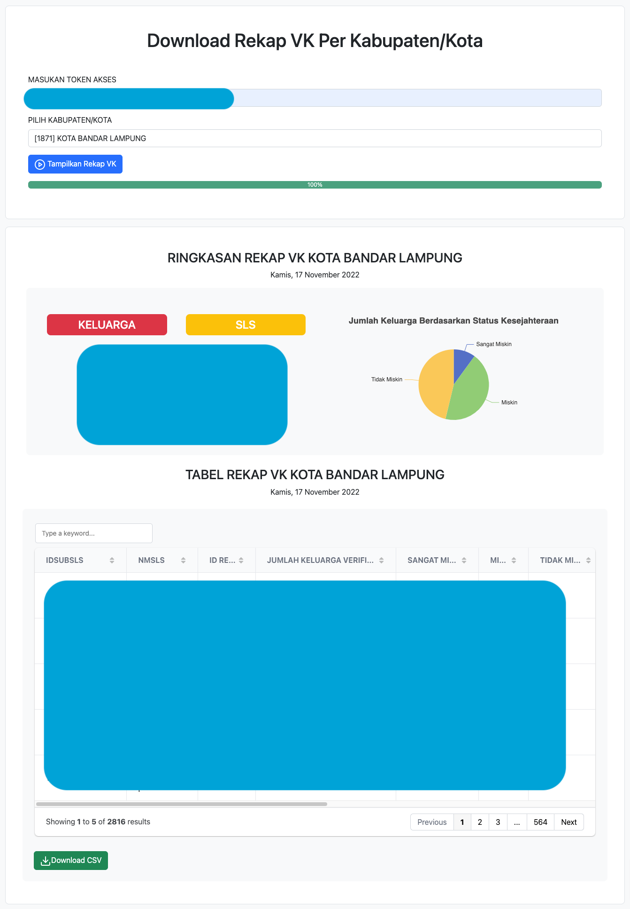

# Rekap VK Regsosek BPS Provinsi Lampung

Aplikasi sederhana untuk download Rekap VK dalam bentuk CSV. Untuk akses data tersebut, form berisi akses token dan pilihan wilayah harus diisi agar hasilnya dapat ditampilkan dalam bentuk tabel. Kemudian, tombol export akan muncul dan hasilnya dapat diunduh dalam bentuk file CSV. Selain itu juga ada fitur ringkasan untuk memudahkan informasi secara global untuk wilayah tersebut. Wilayah sendiri dapat dilakukan eksplorasi sampai dengan tingkat desa/kelurahan.

## Pembangunan Teknologi

Teknologi yang digunakan hanya menggunakan HTML, CSS, dan JS.

## Update Pengembangan

- **[15 November 2022]** Initial commit, menampilkan tabel dan download excel
- **[16 November 2022]** Kustomisasi tampilan, progress bar, serta summary
- **[17 November 2022]** Kustomisasi tampilan dan fitur, update download menjadi CSV
- **[19 November 2022]** Tambahan fitur dengan wilayah diperluas, bisa dipakai untuk semua provinsi, dan update tampilan ringkasan
- **[20 November 2022]** Tambahan fitur dengan wilayah sampe desa/kelurahan, dan update tampilan
## Pengembang

[Eko Teguh Widodo](https://github.com/ekotwidodo/rekap-vk-regsosek2022)